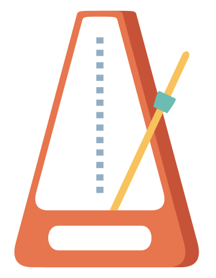

 
<!--

-->
 
# 👋 Hello

I'm **Junian**, an **Experienced Software Engineer** from [East Java](https://en.wikipedia.org/wiki/East_Java), Indonesia.

<!--

-->

## 🧑‍💻 About Me

- I like writing code in [C-family languages](https://en.wikipedia.org/wiki/List_of_C-family_programming_languages) with **C#** and **TypeScript** as my favorite.
- I can speak 3 languages: English, Indonesian, and [Javanese](https://en.wikipedia.org/wiki/Javanese_language) with a little bit of [Javanese Script](https://en.wikipedia.org/wiki/Javanese_script).
- ✍️ I author a [tech and coding blog](https://www.junian.net/) where I publish how-to guides and tutorials mostly about Apple Mac and iPhone. 29K+ monthly views and keep growing. The blog is powered by ~~Blogger~~ Hugo.

> [**Show me the code**](https://github.com/junian?tab=repositories&q=&type=&language=&sort=stargazers)

## 📝 Recent Blog Posts

<!-- blog feed start -->
- [How to Set Your MacBook Screen Resolution to 16:9](https://www.junian.net/tech/macos-16-9-screen-resolution/) February 16, 2026
- [How I Set a Manual Battery Charge Limit on MacBook (Like iPhone 80% Limit)](https://www.junian.net/tech/macos-manual-battery-charge-limit/) February 15, 2026
- [How to Open a Blocked macOS App ("Apple Could Not Verify" Fix)](https://www.junian.net/tech/macos-apple-could-not-verify-app/) February 14, 2026
- [How to Disable Liquid Glass on macOS Tahoe (macOS 26)](https://www.junian.net/tech/macos-disable-liquid-glass/) February 13, 2026
- [How to Install Visual Studio Community 2017 and Fix the Startup Error](https://www.junian.net/dev/install-visual-studio-2017/) February 12, 2026
<!-- blog feed end -->

> [**See more**](https://junian.net/)

## 🎬 Recent YouTube Videos

<!-- youtube feed start -->
- [Installing Visual Studio Community 2015 in 2026 - Visual Studio Older Versions Download](https://www.youtube.com/watch?v=jiCI4KK7aWw) February 17, 2026
- [How to Disable Liquid Glass on macOS 26 Tahoe - Reduce Transparency of any macOS UI](https://www.youtube.com/watch?v=MddF_MUFBBI) February 13, 2026
- [Installing Visual Studio Community 2017 in 2026 and fixing startup error - Older Versions Download](https://www.youtube.com/watch?v=caHVWmJjHuE) February 12, 2026
- [FiberHome HG6145F1 Admin Password - GPON ONU Router / Modem Default Admin Password](https://www.youtube.com/watch?v=yXLriGOsXp4) February 11, 2026
- [How to Disable Liquid Glass on iPhone with iOS 26 - Reduce Transparency of any iPhone](https://www.youtube.com/watch?v=ug3EtEy4CF4) February 10, 2026
<!-- youtube feed end -->

> [**See more**](https://junian.net/yt/)
